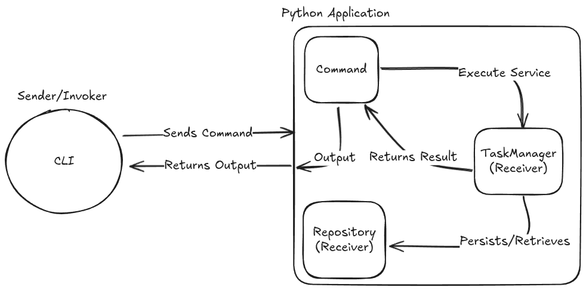

# Software Architechture Document

This software architechture is organized in **Command Pattern** design. It will use *Python* as it's principal programming language and *JSON* files for the database.

## References

- [Refactoring Guru: Command Pattern](https://refactoring.guru/design-patterns/command)