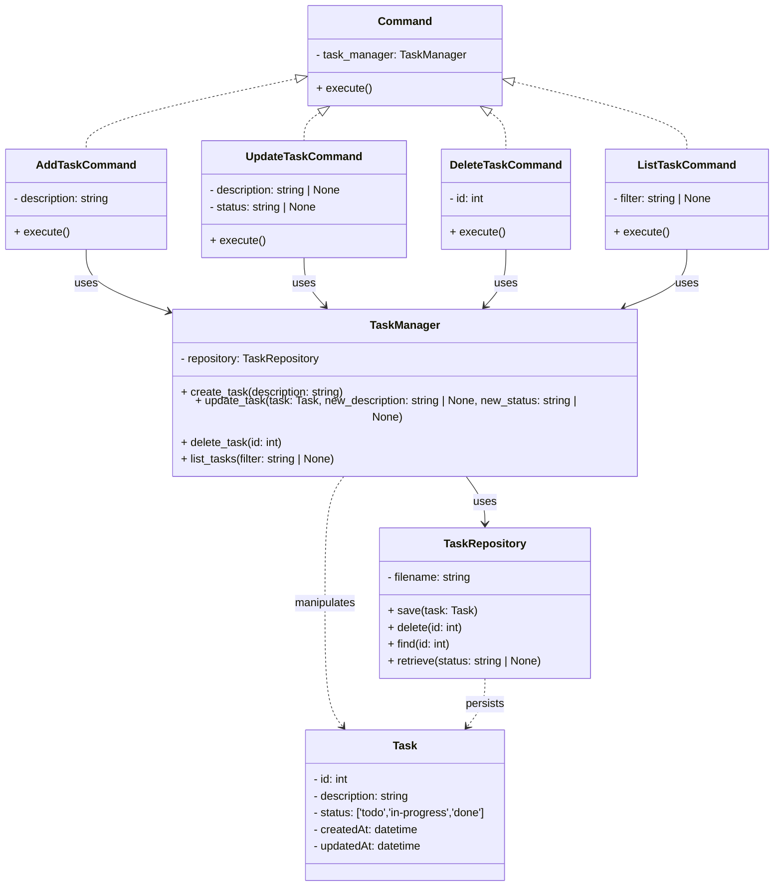

# Data Model

## Entity Description

### `Task`

Represents the user's tasks

- **Attributes:**
  - `id`: Unique identifier for the task.
  - `description`: Task detailed description.
  - `status`: current progress of the task, three options: 'todo', 'in-progress', 'done'
  - `createdAt`: exact date and time when the task was created.
  - `updatedAt`: exact date and time from the last update of the task.

### TaskManager

Manages all users tasks and applies business rules

- **Attributes:**
  - `repository`: Task repository for data persistance
- **Methods:**
  - `create_task()`: Creates a new task with users description, 'todo' status and a new identifier
  - `update_task()`: Updates an existing task status or description
  - `delete_task()`: Delete an existing task
  - `list_tasks()`: Show all tasks or by the specified filter

### TaskRepository

Persists the tasks on the database

- **Attributes:**
  - `filename`: JSON file reference
- **Methods:**
  - `save()`: Persists a task to the local database
  - `delete()`: Deletes a task from the local database by ID
  - `find()`: Searched for a specific task by ID
  - `retrieve()`: Returns all stored tasks or filter them by status

### Command

Realizes the users operations

- **Attributes:**
  - `task_manager`: Task manager reference for business application
- **Methods:**
  - `execute()`: Realize the commands intended function
